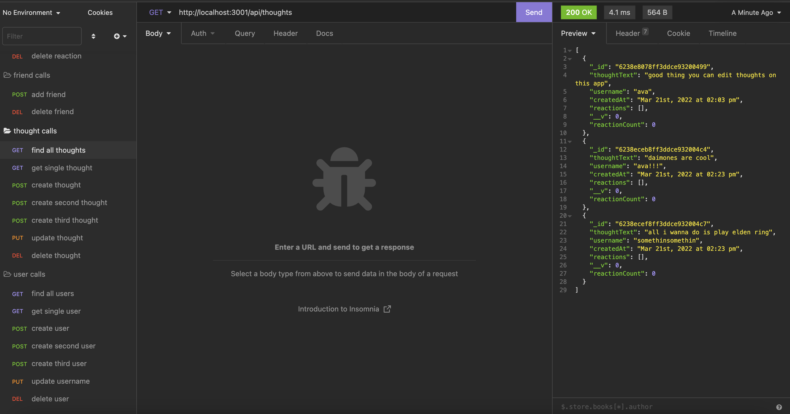

# Basic-Social-API

## Description

This program is desinged to be able to interact with a database using mongoose to store profile and user data for use in a social media app.

## Table of Contents

- [Installation](#installation)
- [Usage](#usage)
- [Contributing](#contributing)
- [License](#license)
- [Questions](#questions)

## Installation

Clone this project your personal computer using the command: 

	git clone git@github.com:avalynnw/Basic-Social-API.git

Then, use: 

	npm i

 to install the required dependencies in the root directory.

## Usage

Make sure to install mongoDB beforehand. Start mongo in a terminal with the command:

    mongo

Keep the terminal running mongo open, or the program will not work. Run the program from a different terminal window in the root directory using:

	npm run start

and then you will be able to send and recive calls at the URL:

    http://localhost:3001/api/

### [Walkthrough Video](https://watch.screencastify.com/v/cXkbDomTdIvz9DSIhpYF)

## Contributing

Collaborators: Avalynn Helgrave, https://github.com/avalynnw

Third-Party Assets: Modules: express, mongoose, nodemon

## License

#### The Unlicense

http://unlicense.org/

## Questions

https://github.com/avalynnw

 Contact me at: avalynnjudge@gmail.com
